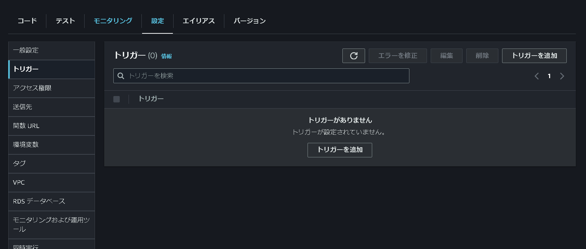
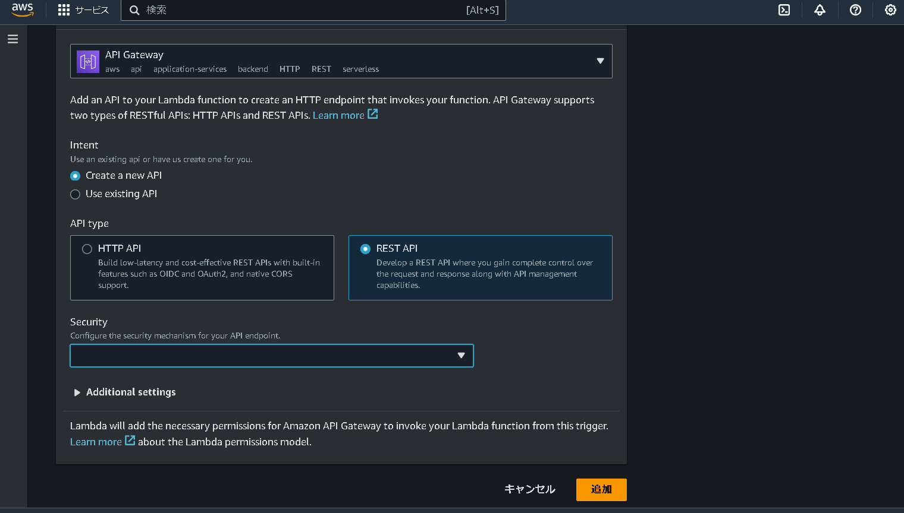
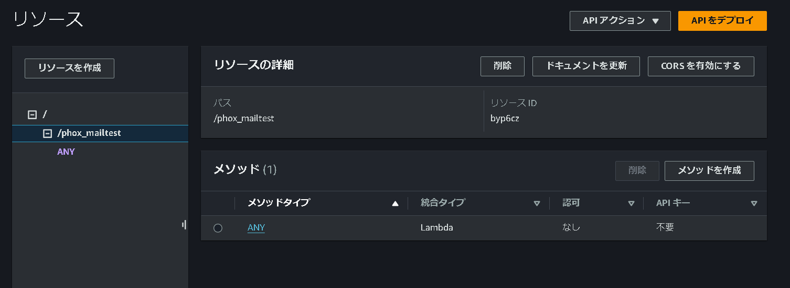
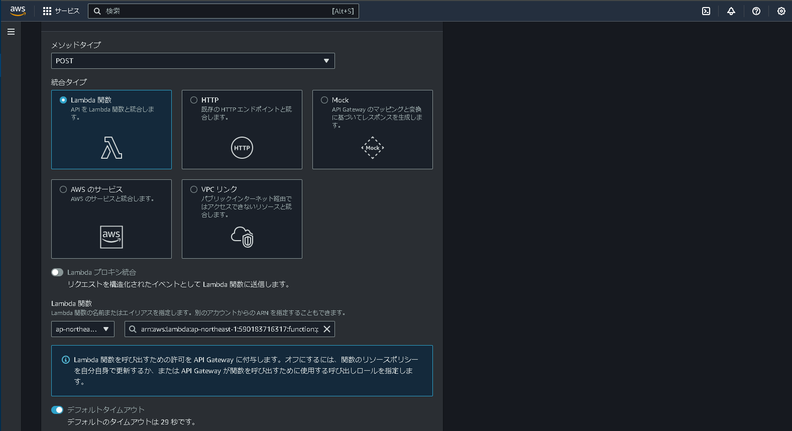

# Phox専用C++ code

## 概要
- このコードの役割は
  - 磁気スイッチのオンオフを読む
  - カメラで画像を撮影する
  - バッテリーの電圧を計る
  - Base64変換した画像、測距センサのデータ、バッテリー電圧をJsonデータとしてAWSのAPIGateWayに送る
- 作成したメインボードに[コード](phox_code)を書き込み磁気スイッチに磁石を近づけるとAWS S3に画像が保存される

## AWSのAPI設定
- ここではAWS lambda上で作成したphox image uploaderにAPI Gatewayを関連付ける

- 作成したlambdaの「設定」->「トリガー」に入り、「トリガーを追加」をクリックする

- 次のように設定
  - トリガー：API Gateway
  - Intent：create a new API
  - API type：REST API
  - Security：Open
- これで「追加」
- できたAPI GatewayをクリックしてAPI Gatewayを編集する

- 左の「リソース」タブに入り、「メソッドを作成」をクリックする

- 次のように設定する
  - メソッドタイプ：POST
  - 統合タイプ：Lambda関数
  - Lambda関数：APIを設定する関数
- これで作成
- POSTメソッドが作成されたらAPIをデプロイする
  - デプロイする際のステージは何でも良い
  - ステージを作成しないのならば「default」
- デプロイすると「ステージの詳細」に「URLを呼び出す」があるのでこのURLを[コード](phox_code)の「AWS_ENDPOINT」にコピペする